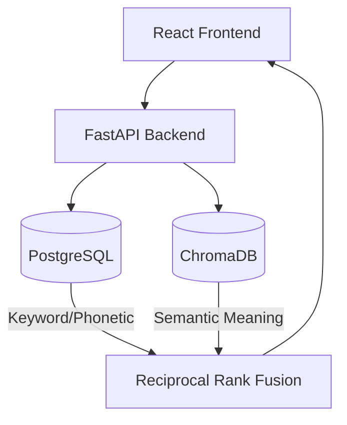

<div align="center">
  
  <h1>SearchOps AI</h1>
  <p><strong>Enterprise-Grade Hybrid Search Engine for AI Workspaces</strong></p>
</div>

---

> [!NOTE]
> SearchOps AI unifies your company's fragmented knowledge base. It combines the exact-match precision of a PostgreSQL Phonetic Search with the semantic understanding of a ChromaDB Vector Search.

## 🚀 Features

- **Hybrid Search Architecture**: Reciprocal Rank Fusion (RRF) algorithm combining SQL phonetic matches and Vector semantic similarity.
- **Enterprise UI**: A clean, lightning-fast React interface inspired by top-tier SaaS platforms.
- **Real-Time Filtering**: Instantly filter results by source (Codebase, Documentation, Incident Reports).
- **Fully Containerized**: Ready for immediate cloud deployment with a multi-stage Docker build.

## 🛠️ Technology Stack

- **Frontend**: React, Vite, Lucide Icons
- **Backend**: Python, FastAPI, Uvicorn
- **Databases**: 
  - `PostgreSQL` (Full-Text & Soundex Search)
  - `ChromaDB` + `sentence-transformers` (Vector Similarity Search)
- **Deployment**: Docker & Docker Compose

## 📦 Getting Started Locally

> [!IMPORTANT]
> Ensure you have [Docker](https://www.docker.com/) and Docker Compose installed on your system.

1. **Clone the Repository**
   ```bash
   git clone https://github.com/yourusername/searchops-ai.git
   cd searchops-ai
   ```

2. **Start the Production Container**
   ```bash
   docker-compose up -d --build
   ```
   This will automatically build the React frontend, start the PostgreSQL and ChromaDB databases, and launch the FastAPI server.

3. **Access the Workspace**
   Open your browser and navigate to: [http://localhost:8000/](http://localhost:8000/)

## 🧠 System Architecture



## 🌐 Deployment to Cloud

This project is configured as a single unified container, making it incredibly easy to deploy to platforms like **Render**, **DigitalOcean App Platform**, or **AWS Elastic Beanstalk**.

1. Push this repository to GitHub.
2. Connect your repository to your Cloud Provider.
3. Deploy! (The `Dockerfile` handles both building the frontend and serving it via FastAPI automatically).

## 🤝 Contributing
Contributions, issues, and feature requests are welcome! Feel free to check the issues page.
