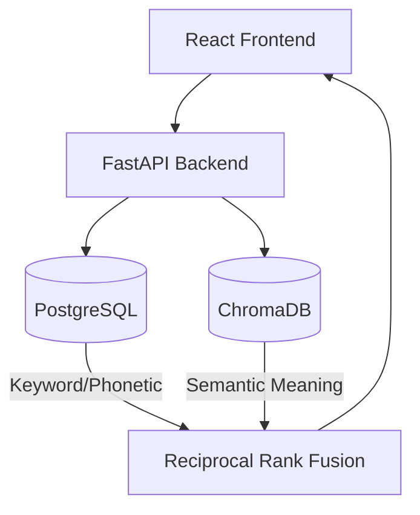

<div align="center">
  
</div>

# SearchOps AI – Enterprise-Grade Hybrid Search Engine for AI Workspaces

SearchOps AI unifies your company's fragmented knowledge base. It combines the exact-match precision of a PostgreSQL Phonetic Search with the semantic understanding of a ChromaDB Vector Search to deliver instant, intelligent engineering context.

**🌍 Live Demo:** [*(Coming Soon - Deploying to Render)*](#)
  
---

## 🔧 Tech Stack


### Frontend

* React
* JavaScript (JSX)
* Vanilla CSS
* Vite
* Lucide Icons

### Backend

* FastAPI
* Python 3.11
* PostgreSQL (Soundex & ILIKE search)
* ChromaDB
* Sentence-Transformers

### Other Tools

* Reciprocal Rank Fusion (RRF)
* Docker & Docker Compose
* Uvicorn
* Git & GitHub

---

## 🚀 Features

### 🚦 Intelligent Hybrid Search
* **Semantic Vector Search:** Understands the meaning behind queries using state-of-the-art embedding models.
* **SQL Phonetic Search:** Catches exact matches and misspelled names using Soundex and fuzzy matching.
* **Reciprocal Rank Fusion:** Dynamically combines vector and SQL scores to surface the absolute best results.

### 📱 Enterprise Professional UI
* Clean, light-mode interface inspired by top-tier SaaS engineering tools.
* Fully responsive navigation and intuitive sidebar layouts.
* Real-time search debouncing for instant feedback without hitting enter.

### 👮 Advanced Filtering & Metadata
* Filter instantly across data sources: Codebase (GitHub), Documentation (Confluence), or Incident Reports (Slack).
* Dynamic badges identifying source origin and relevance scores.
* Integrated author and timestamp metadata tracking.

### 📦 Production-Ready Architecture
* Fully containerized using a multi-stage Docker build.
* Single-container deployment: FastAPI serves both the API and the compiled React static files seamlessly.

---

## 🧠 System Architecture



---

## 📁 Folder Structure

```text
SearchOps AI/
│
├── backend/ (Root)
│   ├── api.py
│   ├── search_engine.py
│   ├── ingest.py
│   ├── requirements.txt
│   └── docker-compose.yml
│
├── frontend/
│   ├── public/
│   ├── src/
│   │   ├── App.jsx
│   │   ├── index.css
│   │   └── main.jsx
│   ├── package.json
│   └── vite.config.js
│
├── data/
│   ├── chroma/ (Vector DB storage)
│   └── mock/   (Sample data)
│
├── logo/
│
└── README.md
```

---

## 🛠️ Setup Instructions

> [!IMPORTANT]
> Ensure you have [Docker](https://www.docker.com/) and Docker Compose installed on your system.

### 🐳 Full Stack (Docker)

To run the entire production-ready stack in a single command:

```bash
docker-compose up -d --build
```
*Wait 1-2 minutes for the initial build, then access the app at [http://localhost:8000/](http://localhost:8000/)*

### 📦 Local Development (Without Docker)

**Backend:**
```bash
pip install -r requirements.txt
uvicorn api:app --reload --port 8000
```

**Frontend:**
```bash
cd frontend
npm install
npm run dev
```

---

## 🎨 UI / UX Designs

*A quick visual walkthrough of the **SearchOps AI** platform showcasing the unified search interface and source filtering.*

| Search Workspace |
| :---: |
| *(Screenshot coming soon)* |

---

## 📌 Future Enhancements

* Role-based access control (RBAC)
* OAuth2 Integration (Google, GitHub, Slack)
* Automated daily ingestion pipelines
* Live document preview within the search UI
* Advanced time-based decay algorithms for search ranking

---

## 🧑‍💻 Authors

**Team SearchOps AI**

* **Nandini Bhardwaj** – GitHub: [https://github.com/Nandini-Sha](https://github.com/Nandini-Sha)

---

## 📄 License

This project is licensed under the MIT License.
